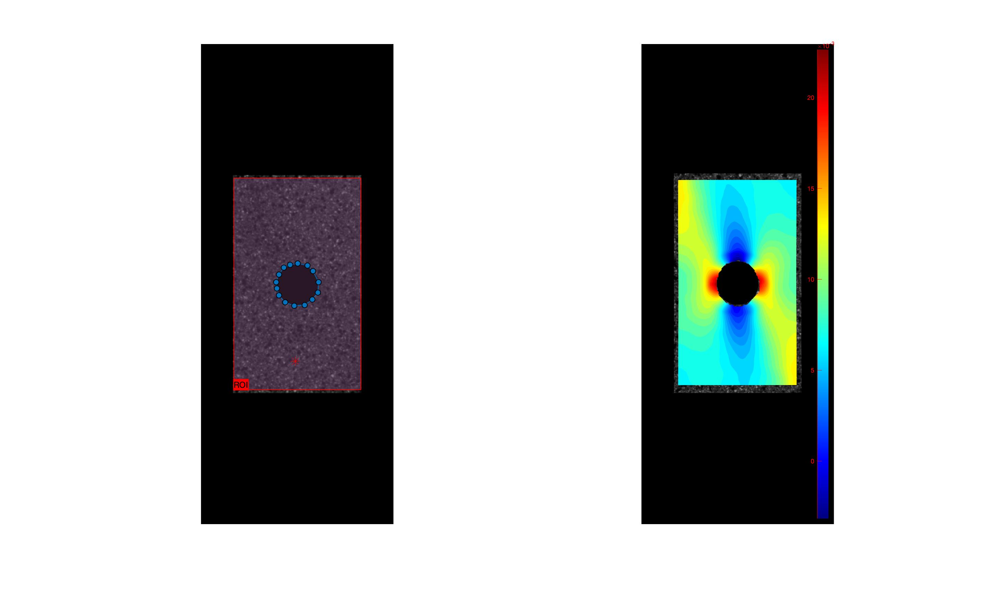
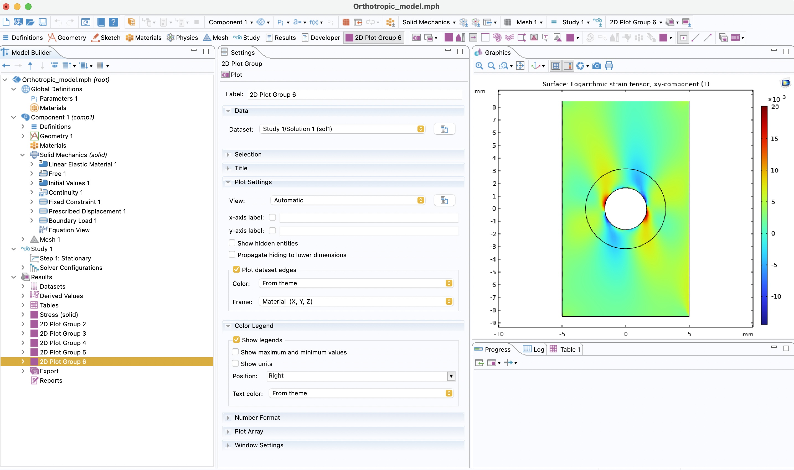
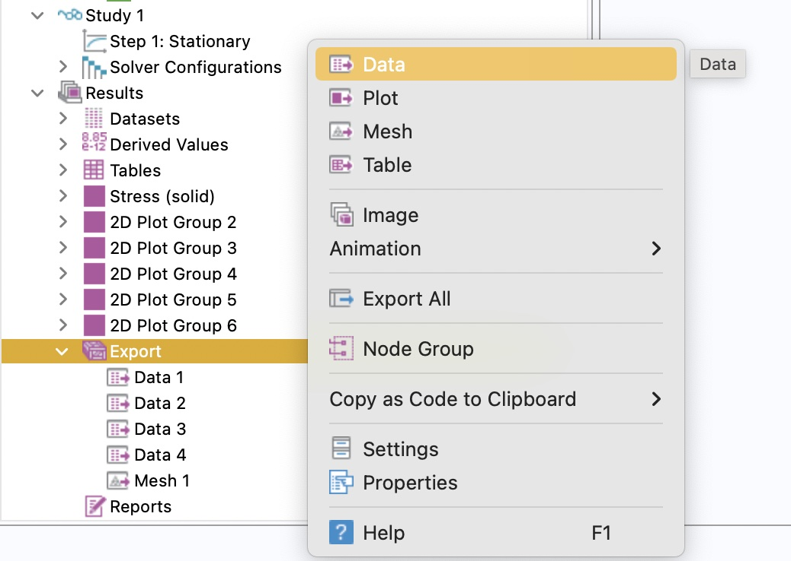

# FEMU-DIC
Author: Bin Chen
E-mail 📧: binchen@kth.se or cbbuaa@outlook.com

## Project summary
FEMU-DIC is an open-source finite element model updating (FEMU) software. It includes two key parts:
- **DIC software**: The  Digital Image Correlation (DIC) software introduced here can be used **Stand-alone**. It works well 😊 for strain fields measurement.
- **FEMU software**.

**Target users**: researchers 🧑‍🔬 who are interested to strain field measurement and/or inverse parameter identification, material scientists, teachers and students 🧑‍💻 in solid mechanics.

😊 ***We may continue updating this software. More functions may be added into this software. You can star this project to follow the update.***

***
## Brief introduction of FEMU and DIC techniques
### FEMU
FEMU is an optimized-based inverse method for calibrating material model parameters. The basic principle is to iteratively refine the material parameters by minimizing the displacement or strain field differences obtained from numerical simulation and digital image correlation. In principle, if we numerically simulate real experiment in FEM using the same sample geometry and boundary condition, the numerical simulation results should be close to the real experimental results if the material parameters in FEM are the same as those of the tested real material. 

**😊 Advantages** of FEMU:
- Simultaneous identification of multiple material parameters through a single complicated test.
- High adaptivity to different material models.
- Straightforward in principle.

**🥺 Limitations** of FEMU:
- Time-consuming, since FE model needs to run for several times.

### DIC

DIC is an image based method for full-field displacement and strain fields measurement. The displacement and strain fields are the key inputs for parameter identification in FEMU. It is implemented by: 

- Applying random speckle pattern on sample surface.
- Recording images of the sample surface during loading.
- Processing the recorded speckle patterns images to retrieve the interested displacement and strain fields. 

The basic assumption is that speckle pattern will move with the material deformation. Therefore, we can obtain the deformation fields by tracking the movement of the features on the images using DIC algorithm.

**😊 Advantages** of DIC:
- Full-field measurement capability for rich information.
- Easy to use.
- Good adaptivity to different loading cases: high-speed, high-temperature, small-scale, large-scale, under-water, etc. Theoretically, it can measure th strain field when good images with random speckle pattern are available.

**🥺 Limitations** of DIC:
- Higher uncertainty than strain gauge.


## 📔 Log

**2024/09/22:**
- Add boundary filling function to preserve more calculation points in DIC. 
  
**2024/09/11:**
- DIC can measure multiple images now.
- More image formats are supported.
- Added explanation about DIC results.

**2024/05/30:**
- Confirmed that FEMU-DIC works properly on MacBook Pro 2020 (Intel chip), macOS 14.4.1. (MATLAB version: 2023b, COMSOL version: 6.1).
  
## Prerequisites
- 🛠️ Some knowledge about FEMU. We recommend you to read our review about FEMU.
- 🛠️ Basic knowledge about COMSOL and finite element simulation.
- 🛠️ Basic coding skills with MATLAB.
- 🛠️ Access to COMSOL and MATLAB.
- 🛠️ Camera and mechanical testing machine.
## Objectives
- Identify the orthotropic elastic parameters of your material.
- Develop your own FEMU software based on our code.
- Use the open-source DIC software alone for strain field measurement.

***
## DIC Software
### Description
The DIC software has the following major features:
1. Enable to select complicated ROI: rectangular and polygon geometries. It can also refine the ROI by cutting from a former ROI.
2. It can fill the boundary regions in ROI to get more information or excluding the boundary region for more accurate matching.
3. It exports ZNCC to indicate the matching accuracy.
4. Flexibility to stop and continue running the software. Interrupting the software running is acceptable. 
  

<p align="middle">
  
</p>
<p style="text-align:center;">Figure 1. Example of DIC matching.</p>

### Usage
1. Download this project and unzip it into a folder;
2. The bicubic B-spline interpolation C++ MEX file has already been created. However, if you have changed the source code, please create it again.
**On MacOS platform**
    * Install Xcode on your mac;
    * Type the following command in MATLAB command window;
  ``
            mex -v -setup C;
            mex -v -setup C++; 
  ``
  
     * Edit and save your C++ code in file `BicubicBsplineInterp.cpp`;
     * Copy the former file to your work directory, and then type the following command in the command window:
``
            mex BicubicBsplineInterp.cpp
``
    * You will get a file `BicubicBsplineInterp.mexmaci64` in your work directory. Finally you can use it like regular MATLAB function.

    **On Windows platform**
    * Install C and C++ compiler. Here the free MinGW-w64 C/C++ complier is recommended. Please check the compatible version from [MATLAB support](https://se.mathworks.com/matlabcentral/fileexchange/52848-matlab-support-for-mingw-w64-c-c-compiler). We have confirmed that MATLAB R2019a is compatible with [MinGW-w64 V6.3.0](https://sourceforge.net/projects/mingw-w64/files/Toolchains%20targetting%20Win64/Personal%20Builds/mingw-builds/6.3.0/threads-posix/seh/x86_64-6.3.0-release-posix-seh-rt_v5-rev2.7z/download) on windows 10.
     * Type the following command in MATLAB command window;
  ``
            mex -v -setup C;
            mex -v -setup C++; 
  ``
    * Edit and save your C++ code in file `BicubicBsplineInterp.cpp`;
    * Copy the former file to your work directory, and then type the following command in the command window:
``
            mex BicubicBsplineInterp.cpp
``
    * You will get a file `BicubicBsplineInterp.mexmaci64` in your work directory. Finally you can use it like regular MATLAB function.
1. Before running, you need to set some **key parameters in `paramset.m`**, such as **subset size**, **step size**. The variable you want to plot is controlled by ``param_Plot``.
2. You must pay attention on parameter **allRegion** in this script. It controls the ROI shape. It has a form of row vector with elements of 1 and/or 2. The number 1 and 2 denotes the selection of a rectangular region and a polygon region, respectively. 
   For instance, we set ``allRegion = [1,2,2]``. It means we first select a rectangular region. Then two polygon regions are removed from the selected rectangular ROI. Note that when you are selecting a rectangular region, you need hold the mouse and drag it.
3. Run `demo.m`. In the first pop-up window select one reference image, and in the second pop-up window select a deformed image or a set of deformed images. The number of elements in this vector should be more than 1. 
4. Set whether do you want to fill the boundary in `Param.fill_boundary`. If 1, fill the boundary, or 0 is not.
5. Select the ROIs following **Step 4**. After specifying all ROIs, you need to specify a seed points. It is recommended to put it at the place with smaller displacement.
6. Please wait for the software to run. The running information will display on the Command Window
 ```
 Matching method: IC-GN-RG; 
Subset size: 25 * 25;  
Step: 5;
Processing finished :100 % ...
Speed: 2.038e+03 points/s
Completed in 3.965 seconds
Mean iteration: 1.63
Img_Simu_0001.bmp is matching...
```
1. The results are saved in the same folder with the same file name but format of `.mat`;
2. If you want to rerun DIC, you need to remove ``Params.mat`` and the result file ``*.mat`` in the image folder. If you want to rerun but keep the same parameters, then you need to remove the result file ``*.mat`` while keeping ``Params.mat``.

### 🗂️ Result files
- The results (``Left of Figure 2``) include data file for each image. They are saved as the same name as the image name but with ``.mat`` as extension. The other data file is the ``.Params.mat``, where the parameters used in DIC are saved.
- In each data file, it (``Upper right of Figure 2``) includes the computational points (``comptPoints``), Displacement (``Disp``), Strain (``Strain``), ZNCC (``ZNCC``), Iteration number (``iterNum``), index of the point in ROI (  ``Is_indPtInROI``).
- The coordinate system is shown in ``Lower right of Figure 2``.
- Detailed explanation of the data is shown below
  - ``comptPoints``: size of $N\times2$, where the first and second columns are pixel coordinates along x  and y directions, respectively.
  - ``Disp``: size of $N\times2$, where the first and second columns are displacement along x  and y directions, respectively.
  - ``Strain``: size of $N\times3$, where the first, second and third columns are strain tensor e<sub>xx</sub>, e<sub>yy</sub>, e<sub>xy.
  - ``ZNCC``: size of $N\times1$, and it denotes the ZNCC coefficient at each point. The value close to 1 means a good point, otherwise bad.
  - ``iterNum``: size of $N\times1$, and it denotes the iteration number at each point. Larger iteration number means a bad correlation result.
  - ``Is_indPtInROI``: size of $N\times1$, and 1 denotes the point is an effective point in ROI, while 0 means that point is not included in ROI
    
  <p align="middle">
    
  </p>
<p style="text-align:center;">Figure 2. DIC results explanation.</p>

***
## FEMU software
1. The FEA solver used herein is COMSOL Multiphysics. The FEA project should be built in COMSOL.
    
<p style="text-align:center;">Figure 3. COMSOL interface.</p>

1. First prepare the DIC results. The file could either from our open-source software. As mentioned before. The data files from VIC-2D (commercial software from Correlated solution) and MatchID-2D are also acceptable as the input. All data should be in global coordinate system instead of material coordinate system.
   - **VIC-2D file**: should be saved as ``.mat`` file. Please don't exclude any data when exporting the data;
   - **MatchID-2D file**: should be saved as ``.csv`` file. The data should be saved in column. The data from 1-7 column should be X, Y, U, V, exx, eyy, exy;
2. The DIC data file from commercial software should be convert to an acceptable format. Please run script ``Data_Converter_MAIN.m``
  - ``software``: select either ``'VIC'`` or ``'MatchID'``
  - ``folderName``: The folder where you save your DIC data.
  - ``scale``: The data should be saved in unit of ``pixel``. Therefore, you need to specify the scale information.
  - ``dataformat``: Here we use ``mat`` for VIC-2D and ``csv`` for MatchID.
  - The reformated data will be saved in a subfolder ``folerName/formatVICData``. All file will be saved as the same file name but in the subfolder. Besides that, some key parameter in DIC are saved in ``Params.mat`` in the same subfolder.
3. The mesh in COMSOL should be exported with format of ``.nas``. Save it at a certain folder and remember the file path. Please rename the mesh as ``Mesh.nas``. 
4. A key issue is the communication between COMSOL and MATLAB. To do that, we need to:
  - Prepare the COMSOL project.
  - Right click ``Export`` in COMSOL and export ``Data``. Choose ``solid.elogxx``, ``solid.elogxy``, and ``solid.elogyy`` in the folder. Select one more folder and export ``u``, ``v``. 
  <p align="middle">
    
  </p>
<p style="text-align:center;">Figure 4. Data exporting in COMSOL.</p>

   - Save the COMSOL project as a MATLAB script ``.m``.
   - Please check ``Orthotropic_model_demo.m`` carefully. You need to make some modification on this file. Please see all parameters passed through ``Params_FEMU``. You can learn how to implement this by comparing two scripts ``Orthotropic_model_demo.m`` and ``Orthotropic_model_demo_original.m``. ``Orthotropic_model_demo_original.m`` is the script directed exported from COMSOL. ``Orthotropic_model_demo.m`` is the script that will be called by MATLAB in iteration, and it is modified from ``Orthotropic_model_demo_original.m``
1. In order to run FEMU-DIC successfully. You should not directly open MATLAB. Instead, you need to run the codes through ``COMSOL with MATLAB``, a software installed together with COMSOL.
2. Several parameters need to be set in ``FEMU_OPEN_MAIN.m``.
   - ``Params_FEMU.folder_Model``, the path where the MATLAB version COMSOL model being saved.
   - ``Params_FEMU.file_params_DIC``, the DIC data file or the reformated DIC data from MatchID-2D or VIC-2D.
   -  ``Params_FEMU.optim_method``, It should be either 'GN' or 'NM'. The aim is to select different optimization algorithm.
   -  ``Params_FEMU.meshFile ``, the path of the exported mesh.
   -  ``Params_FEMU.fileDef_All``, cell structure of the DIC data file.
   -  ``Params_FEMU.SCALE``, the scale between the metric coordinate system (FEA model) and the pixel coordinate system (Speckle pattern image).
   -  `Params_FEMU.offset`, the offset of the origin between the two coordinate system (unit of pixels).
   -  ``R``, ``theta``, and ``L`` are the radius of the open hole, the off-axis angle of the sample and the length of the sample, respectively.
   -  ``p_Model``, the initial guess of the investigated constitutive material model parameters.
3. Note that the COMSOL model is called in ``callComsol``.
4. FEA displacement and strain results are saved in subfolder ``FEA_results``.
5.  If you are using ``GN`` algorithm, please check ``log.txt`` file for the parameter history.
6.  Run ``FEMU_OPEN_MAIN.m`` and wait for a while. The parameters are saved in parameter ``p_Model_optimum``. You can find it in the Workspace.

***
## Validation
### 🔬 Experiments & Results
We use the software to inversely identify the four orthotropic elastic parameters. The test is an uniaxial tensile test of perforated strip sample with thickness of 1 mm. The sample has an off-axis angle of 105°. The sample geometry information is given on ``Figure 5(a)``. Force boundary condition with value of 950 N is applied. numerically generated Speckle pattern images are numerically generated to mimic the real test, see ``Figure 5(b)``. The images are generated from the displacement fields simulated from FEA. The image size is 1501×601 pixels with a scale of 40 pixels/mm. The ground truths of the constitutive parameters E<sub>1</sub>, E<sub>2</sub>, ν, G<sub>12</sub> are 13.9 GPa, 5 GPa, 0.1, 2 GPa, respectively. In local DIC, the subset size, step size are set as 21×21 pixels, and 5 pixels respectively. The initial guess of these parameters is given as 0.9 times of the ground truths. The strain field involved in the images can be measured by DIC software. The strain fields measured by the open-source DIC software is shown in ``Figure 5`` with a strain window size of 21×21 points.

<p align="middle">
  
</p>

<p style="text-align:center;">Figure 5. Numerical test configuration: (a) sample geometry and boundary condition, (b) the synthetic speckle pattern images.</p>

<p align="middle">
  
</p>
<p style="text-align:center;">Figure 6. Strain fields measured by DIC.</p>


In the inverse parameter identification, open-source DIC software, VIC-2D and MatchID-2D are used to calculate the strain fields, while GN and NM are used as the optimization algorithm, respectively. The identified parameters are given in Table 1. Different combinations of DIC software and optimization algorithm can all lead to decent estimation of the parameters. 

<center>Table 1. The parameter identification results with different combinations of DIC software and optimization algorithms.</center>

|Parameters|	E<sub>1</sub>$~$(GPa)|	E<sub>2</sub>$~$(GPa)	|ν	|G<sub>12</sub>$~$(GPa)|	Running time (s)|
|-------|-------|--------|--------|-------|-------|
|Reference value|	13.9|	5	|0.1	|2	|\\ |
|GN + Open-source DIC|	13.903|	5.2991|	0.1021|	1.9999|	76|
|GN + MatchID-2D|	13.966|	5.0489|	0.0997|	2.0024|	76|
|GN + VIC-2D|	13.917	|5.0159	|0.0987|	1.9996|	71|
|NM + Open-source DIC|	13.863	|5.3709|	0.0980	|1.9995|	246|
|NM + MatchID-2D|	13.913	|5.2816|	0.0873	|2.0057|	229|
|NM + VIC-2D|	13.824|	5.1887|	0.0873|	2.0069|	202|

### Demo for practice
We share the the original file to help you to practice the software. Please see the subfolder ``Demo``.
  - ``Orthotropic_model.mph``, the COMSOL Multiphysics project file.
  - ``Orthotropic_model_demo_original.m``, the MATLAB version project file.
  - ``Orthotropic_model_demo.m``, the MATLAB version project file. Some modification were made. The aim is to communicate with FEMU. The parameters can be updated in this file.
  - ``Mesh.nas``, the mesh of the FEA model. It is exported from COMSOL.
  - ``log.txt``, it saves the log information about the parameters.
  - ``VirtualImage``, the subfolder including the speckle pattern images for the open-source DIC software. You need to put your reference image and deformed image into this folder. After running the open-source DIC software, we get two files. ``Params.mat``, and ``Img_Simu_0001.mat`` in the same folder. ``Params.mat`` saves the DIC parameters. ``Img_Simu_0001.mat`` saves the DIC matching result of image ``Img_Simu_0001.bmp``.
  - ``VirtualImageVIC``: the subfolder that save speckle pattern images for VIC-2D. ``Img_Simu_0001.mat`` is the matching results exported from VIC-2D. We need to reformat the data from VIC-2D to match FEMU-DIC requirement. Then, you need to run ``Data_Converter_MAIN.m`` to reformat the data. The results are saved in a new subfolder ``formatVICData``, the data format are the same as the ones generated by our open-source DIC software.
  - ``VirtualImageMatchID``: the subfolder that save speckle pattern images for MatchID-2D. ``Img_Simu_0001.bmp 1.csv`` is the matching results exported from MatchID-2D. We need to reformat the data from MatchID-2D to match FEMU-DIC requirement. Then, you need to run ``Data_Converter_MAIN.m`` to reformat the data. The results are saved in a new subfolder 
  - ``FEA_results``, The results exported from COMSOL are saved in this subfolder. They are the displacement and strain data.
***

## 🤔 Questions & Suggestions
Please contact Bin Chen (binchen@kth.se) if you wish to contribute code/algorithms to this project, or have question or suggestion. 

## Citation
Anyone who uses the code please cite: ``Bin Chen, Bojan Starman, Miroslav Halilovič, Lars A.Berglund, Sam Coppieters, Finite Element Model Updating for Material Model Calibration: Review and Practice Guide. (Under Review)``. If you need to redistribute the software, please keep the original author information.
